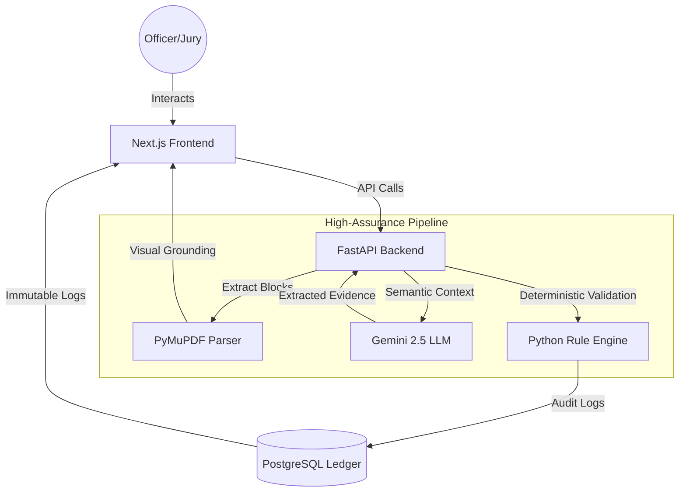
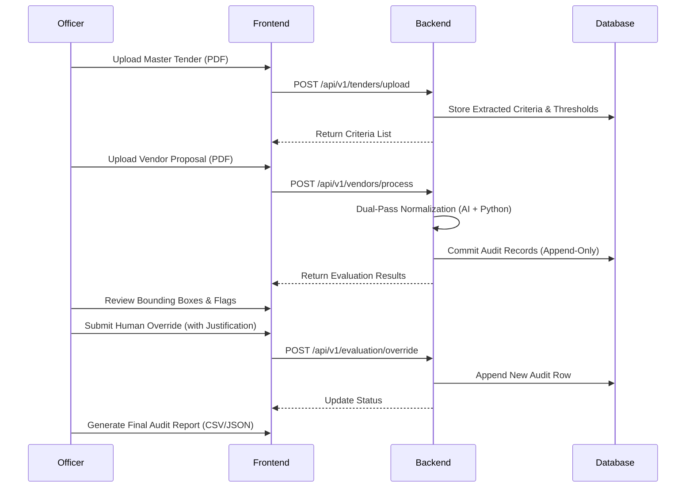

# Aegis: High-Assurance Procurement Gateway

### 🛡️ Executive Summary
Aegis is an auditable, high-assurance evaluation engine designed for government procurement (CRPF Tender Evaluation). It transforms dense PDF submissions into deterministic compliance verdicts with an immutable human-in-the-loop audit trail. Built for precision, Aegis ensures that AI is used only for extraction, while final decision-making is strictly deterministic and visually grounded.

---

### 🏗️ System Architecture



### 🔄 Process Flow



---

### 📂 Project Structure

```text
aegis/
├── app/                    # Backend (FastAPI)
│   ├── api/                # API Routes & Dependencies
│   ├── core/               # Configuration & LLM Clients
│   ├── domains/            # Domain-Driven Logic (Tender, Vendor, Eval)
│   │   ├── tender/         # Tender Ingestion & Models
│   │   ├── vendor/         # Vendor Processing & Models
│   │   └── evaluation/     # Rule Engine & Audit Logs
│   └── main.py             # FastAPI Entry Point
├── aegis-ui/               # Frontend (Next.js 16 + Tailwind v4)
│   ├── src/
│   │   ├── app/            # Next.js App Router (Landing, Upload, Evaluate)
│   │   ├── components/     # Modular UI (Layout, PDF, Evaluation)
│   │   └── lib/            # Utilities & Theme Engine
├── alembic/                # Database Migrations
├── AGENTS.md               # System Directives & Logic Rules
└── docker-compose.yml      # Infrastructure (Postgres)
```

---

### 🚀 Local Execution (Zero-Latency)

**Prerequisites**: Docker, Python 3.11+, `uv` package manager, Node.js 18+.

#### 1. Spin up Infrastructure
```powershell
docker-compose up -d
```

#### 2. Initialize Backend
```powershell
# Install dependencies & run migrations
uv sync
uv run alembic upgrade head

# Launch FastAPI server
uv run uvicorn app.main:app --host 0.0.0.0 --port 8000 --reload
```

#### 3. Initialize Frontend
```powershell
cd aegis-ui
npm install
npm run dev
```

---

### 🧪 Demo Sandbox Guide

Use the provided files in `tests/mock_data/` for a perfect 5-minute demo:

1.  **Ingest Tender**: Navigate to **System Entry**. Upload `Tender_CRPF_01.pdf`. Review the extracted thresholds (₹5 Cr turnover, ISO 9001).
2.  **Evaluate Vendor**: 
    *   **Vendor A (ClearPass)**: Upload to see an automated green "PASS".
    *   **Vendor B (ClearFail)**: Upload to see a deterministic "FAIL" on turnover.
    *   **Vendor C (Ambiguous)**: Upload to trigger a `PROXIMITY_REVIEW_REQUIRED` flag.
3.  **Human-in-the-Loop**: Select the flagged item, review the context in the PDF viewer, and submit a **Manual Override** with justification to resolve the audit trail.

---

### ⚖️ Jury Evaluation Mapping

| Criteria | Aegis Implementation |
| :--- | :--- |
| **Real-World Deployability** | Local Dockerized PostgreSQL + UV deterministic lockfiles. |
| **Auditability** | Append-only Postgres ledger + Mandatory human justification. |
| **Explainability** | Visual grounding (PDF highlighting) of every extracted evidence. |
| **Robustness** | Dual-Pass Cross-Check (Python vs. AI) to eliminate hallucinations. |

---

*Developed for the AI for Bharat Hackathon (Theme 3: CRPF Tender Evaluation).*
